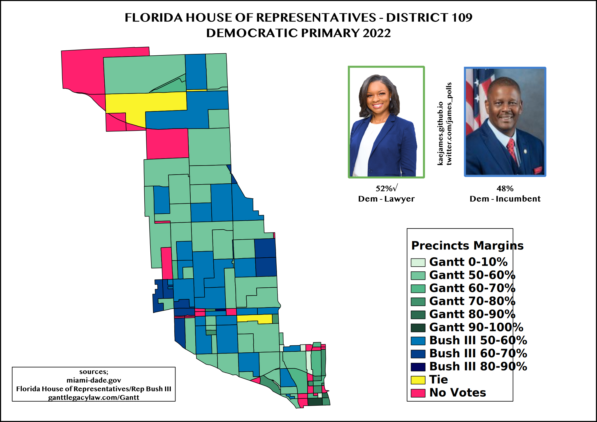

Maps I made for election results using mainly QGIS which is an open source program.

--------------------------------

##  Hillsborough County,FL  

###  Judicial Election 

The primary for this nonpartisan judicial race was on August 23, 2022. Nancy L.Jacobs defeated incumbent Judge Smith 52% to 48%.

Hillsborough County Judge Jared Smith made national headlines in the New Year[2022] after he denied abortion to a 17 yr old due to her "B" grades which he said it proved the the teenager was not smart to make her decisions. Smith's ruling was later overturned. In April, local attorney Nancy L.Jacobs filed to run against Smith. Although this a nonpartisan position, Jacobs received support from local Democratic party, activists and abortion rights advocates.

 

###  Congressional Primary 

A look at congressional district 15 part of Hillsborough county primary vote for the two parties.

 

The republicans won the primary vote by 4%, the eastern side of the county and part of the district is republican. This district is one of four competitive district, Trump won it by 3.1% while he lost national by 4.5%. 

  

###  Congressional vs County Judge Primary 

Comparing the two primaries for the Florida Congressional district 15. 

 

Although the combined republicans won the county party by 4%, County Judge Smith won it by 1.8% or by 1,237 votes over challenger Jacobs. The county judge race attracted more voters compared to the congressional. About ***7,251 more voters cast their ballots for the county judge race***, Jacobs got **4,268(58.9%)** and Smith got **2,983(41.1%)**. There weere voters who were motivated by abortion and cast their votes against Smith but not on the congressional primary.  

 

##  Australian Elections  

###  Boothby Constituency  

A historic win for Australia Labor party candidate **Louise Miller-Frost**.

Australia held it’s federal election on May 21, 2022. The conservative coalition government lost about 20 seats to the green party, independent candidates and the labor party. One of the wins Labor secured was the seat of Boothby in South Australia state that had been held by conservative parties for seven decades. Louise Miller-Frost won this seat by 6% on the second preference.

 

##  Suffolk County,MA 

###  District Attorney Primary 

2018 Suffolk County District Attorney primary dominated by criminal justice reform advocates and a protege. 

Rachel Rollins won the district attorney primary with plurality by defeating three other candidates. Rollins won Cities of Boston and Chelsea but lost the smaller cities of Revere and Winthrop. Rollins win was important to the reform movement as she supported criminal justice reform. She went on to win in November and in 2021 President Biden nominated her to be Massachusetts State Attorney, the senate approved her nomination in 2022. 

 

##  City of Chelsea, MA 

###  Gubernatorial Primary 

Maura Healey was running unopposed in the Massachusetts democratic gubernatorial primary

Attorney General and gubernatorial candidate **Maura Healey** under performed in Suffolk County where she got less than 80% of the vote mainly because she did the worst in city of Chelsea. Healy was held under 60% while running unopposed since her opponent dropped out of the race. It's not surprising Healey didn't do well in Chelsea since it's one of the most liberal city in the county and she was deemed not liberal enough. 

 

###  District Attorney Primary 

For the Suffolk County District Attorney, it was appointed incumbent DA Hayden vs city of Boston council member Ricardo Arroyo.

Arroyo won the city of Chelsea by 10% as he struggled and lost Boston, Revere and Winthrop. Hayden won the District Attorney primary to fill out the remaining 2yrs vacated by Rachel Rollins as she was appointed to be State Attorney. 

 

##  Florida House District 109 

###  Democratic Primary 

The primary was held on August 8th, 2022 between an incumbent and newcomer.

 

Democratic lawyer Ashley Gantt defeated longtime incumbent James Bush III in the primary for the house district 109. Bush faced the primary because he voted to limit abortion to 15 weeks, only democrat in the Florida house to do that. He also voted for laws attacking LBGTQ and workers that were push by DeSantis and the republicans. James had been in the house for years and had the backing of heavyweights in the district. 

 

##  Seoul, South Korea 

###  2022 Mayoral Election 

Seoul City mayoral election was held on June 1st, 2022.

 

Conservative incumbent Oh Se-hoon of People Power won the election in a landslide for a full term against Song Young-gil of Democratic party of Korea. Oh won all 25 districts and winning by large margins in the wealthy areas south of the river like Gangnam district that is well known worldwide. This election followed the presidential election in March where the conservative candidate won Seoul by less than 5%. The turnout for the mayoral electon was just 53% compared to the 70%> for presidential election. 

 

##  City of Philadelphia, PA 

The statewide and local primaries were held on May 17th, 2022 across the state. The turnout in Philadelphia was just 23%. In the senatorial primary, Democrats got 87.7% and the Republicans got 12.3% out of 248k total ballots cast. 

###  Democratic Senate Primary 

The Democratic primary for the senate was between the Lt.Gov Fetterman, State Rep Kenyatta and Congressman Lamb. Fetterman beat Kenyatta by more than 2% and went on to win the state primary. Fetterman did well in the white, liberal and working class areas, while Kenyatta and Lamb did well in black and latino areas respectively. 

  

###  Republican Senate Primary 

The Republican primary featured tv host Dr.Oz, businessman Dave McCormick and YouTuber rightwing activist Kathy Barnette. Dr.Oz easily won Philadelphia that ultimately gave him the edge statewide against McCormick. Maybe Dr.Oz did well in the city since he lived across the river in New Jersey?lol.  

Since Philadelphia is a strong Democratic city, many precincts didn't have votes especialy the black populated areas shaded in yellow. There were also many precincts where the three candidates tied the vote that is shaded black. It will be interesting to see how Dr.Oz will do in November against Fetterman. 

 

###  2016 U.S Senate General Election 

A look at the 2016 senate race between incumbent Senator Toomey vs Democratic candidate McGinty in the most republican area of Philadelphia.

Wards 58 & 66th are in the most republican area of Philadelphia, they are represented in the City Council by longtime republican Brian O'Neill as part of the 10th district. Councilor O'Neill is also the minority leader in the city hall. The area is a white working class area, with a majority of Irish-Americans but also other ethnic whites, asians, black and latino growing population. Sen Toomey won the 66th by a larger margin but barely won the 58th. 

